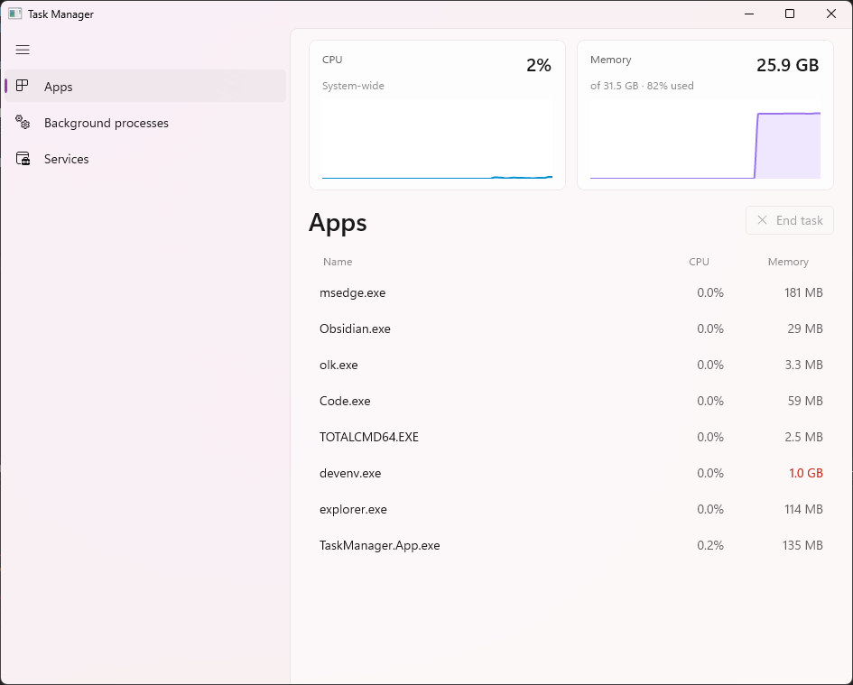

# Task Manager

A personal, daily-use Windows task manager — Fluent-styled, WinUI 3. This is a **research
and learning project**: an exercise in building a real Windows app from a locked spec, raw
Win32 interop, and spec-driven development — not a replacement for the built-in Task
Manager. The repository implements the locked [v1 spec](docs/spec/v1.md); the glossary it
shares with the code is [`CONTEXT.md`](CONTEXT.md).



Three views (Apps · Background processes · Services) behind a left rail, a pinned
system-wide CPU + memory graph strip, per-process CPU %/memory columns, and **End task** as
the only mutating action. Everything else is read-only.

## Tech stack (ADR-0001)

| Concern | Choice |
| --- | --- |
| Language | C# |
| UI | WinUI 3 / Windows App SDK (unpackaged desktop) |
| Charting | LiveCharts2 (`LiveChartsCore.SkiaSharpView.WinUI`) |
| Data access | Raw Win32 via **CsWin32** source-generated P/Invoke |
| MVVM | CommunityToolkit.Mvvm |

## Solution layout

```
TaskManager.sln
├─ src/TaskManager.Core        net8.0 class library — platform-neutral, framework-free
│  ├─ Models/                  ProcessSample, ServiceSample, SystemSample, MonitorSnapshot, enums
│  ├─ Monitoring/              ClassificationRule (§7), CpuMath, RollingWindow, constants
│  ├─ Presentation/            ViewDescriptor (the per-view table), usage-heat thresholds
│  ├─ Collections/             CollectionSync — reconcile a bound list by key, in place
│  ├─ Text/Humanize.cs         "842 MB" / "1.8 GB" / "12.4%" formatting
│  └─ Abstractions/            IProcessSource, IServiceSource, ISystemMetricsSource,
│                              IProcessTerminator, IElevationService
├─ src/TaskManager.App         net8.0-windows WinUI 3 head
│  ├─ Interop/                 CsWin32-backed implementations of the Core contracts
│  ├─ Monitoring/              MonitorEngine (the single 1 Hz loop)
│  ├─ ViewModels/              MainViewModel, row/graph VMs, End task flow
│  ├─ Converters/              heat / visibility / pill brushes
│  ├─ NativeMethods.txt        the CsWin32 binding surface (spec §4 / §9)
│  ├─ App.xaml(.cs)            shared resources + entry point
│  └─ MainWindow.xaml(.cs)     NavigationView + MicaBackdrop shell, composition root
└─ tests/TaskManager.Core.Tests   xUnit tests for the pure logic
```

### Why the split

`TaskManager.Core` holds what is framework-free and worth pinning with tests — including
presentation *facts*: the App/Background rule (§7), the CPU delta math, the rolling 60 s
window (§5), number formatting, the usage-heat thresholds (§6), and the per-view table
behind the rail. `TaskManager.App` holds what binds to WinUI, Win32, or the dispatcher.

All Win32 access sits behind the interfaces in `TaskManager.Core.Abstractions`. Those
contracts stay in Core not because anything varies across them, but because they *are* the
platform line: they let Core's model types be the currency of a tick while the `PInvoke`
code lives in a project Core cannot reference. That keeps the spec-critical logic testable
on any host (see `tests/`), while the interop, the WinUI-bound view models, and the XAML
stay in the WinUI head.

The data flow is one direction per tick: `MonitorEngine` (a background 1 Hz loop) samples
the three sources off the UI thread, then marshals a `MonitorSnapshot` to the UI thread,
where `MainViewModel.Apply` reconciles the bound collections in place (so selection and
scroll survive the refresh).

## Building and running

> **Windows only.** `TaskManager.App` is a WinUI 3 / Windows App SDK app and builds only on
> Windows with the toolchain below. `TaskManager.Core` and its tests are plain `net8.0` and
> build/run anywhere.

Prerequisites:

- Windows 10 22H2 / Windows 11 22H2 or later. (The Memory column uses
  `PROCESS_MEMORY_COUNTERS_EX2.PrivateWorkingSetSize`, which needs 22H2+.)
- .NET 8 SDK.
- The **Windows App SDK 1.8** / WinUI 3 workload (Visual Studio 2022 "Windows application
  development", or the standalone Windows App SDK). The NuGet packages restore from
  nuget.org via the repo-level `nuget.config`.

```powershell
# Run the pure-logic tests (any OS with the .NET 8 SDK):
dotnet test tests/TaskManager.Core.Tests

# Build and run the app (Windows):
dotnet build src/TaskManager.App -c Debug
dotnet run  --project src/TaskManager.App -c Debug
```

The app runs **un-elevated** by default (spec §4). Ending another user's or a service's
process surfaces a **Restart as administrator** dialog rather than requesting admin up
front (spec §8).

## Spec traceability

Every requirement in the spec's [§9 checklist](docs/spec/v1.md) maps to code:

| Requirement | Where |
| --- | --- |
| NavigationView + MicaBackdrop shell, system dark/light | `MainWindow.xaml(.cs)`, `App.xaml` |
| 1 Hz loop; rolling 60 s buffers | `Monitoring/MonitorEngine.cs`, `Core/Monitoring/RollingWindow.cs`, `MonitorConstants` |
| CsWin32 bindings | `NativeMethods.txt` + `Interop/*` |
| App/Background classifier (§7) | `Core/Monitoring/ClassificationRule.cs`, `Interop/WindowClassifier.cs` |
| Two LiveCharts2 filled-line series, pinned | `ViewModels/GraphViewModel.cs`, `MainWindow.xaml` graph strip |
| Process/Services lists | `MainWindow.xaml`, `ViewModels/*RowViewModel.cs` |
| End task: select-then-kill, confirm, blank-cell degradation, elevate on Access Denied | `ViewModels/MainViewModel.cs`, `Interop/ProcessTerminator.cs`, `Interop/ElevationService.cs`, `MainWindow.xaml.cs` |
| Negligible self-overhead (no PDH-per-process / WMI) | `Interop/*` — toolhelp snapshot + cheap handle queries only |

## License

MIT — see [LICENSE](LICENSE). Built for research and learning; use at your own risk.
